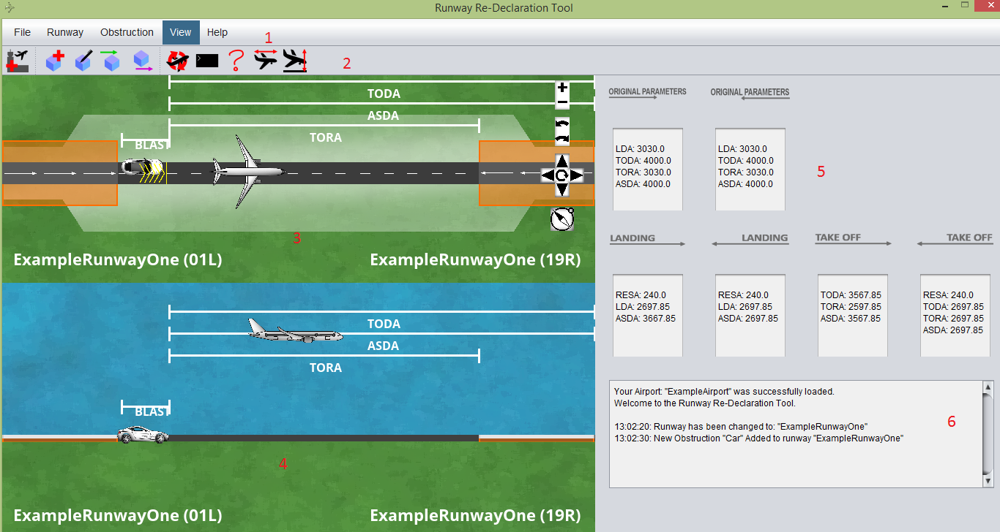
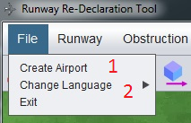
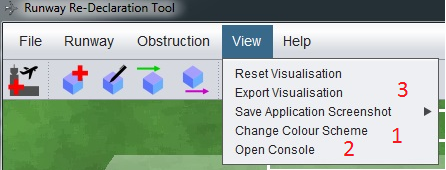
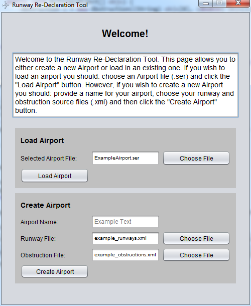
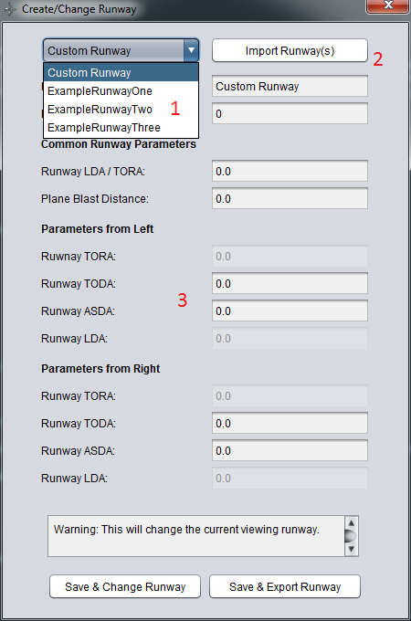
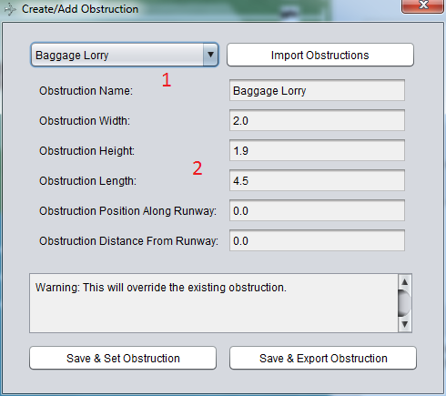
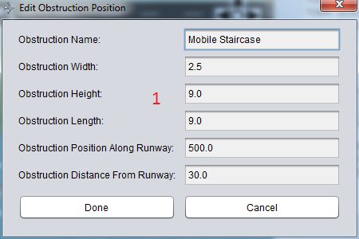
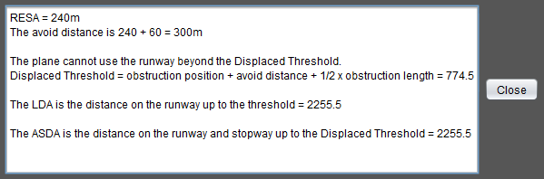
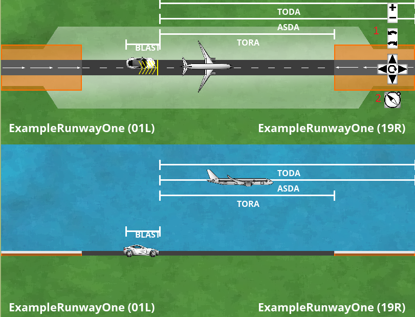

# Introduction

The Runway Redeclaration Tool is a tool designed to aid the redeclaration of UK runways. It provides an automatic breakdown and calculation of parameters as specified by the UK Civil Aviation Authority, along with providing animated visualisations to increase productivity of redeclaring runways.

## How to use this Guide

**Section One** provides a brief overview of the interface along with features available within this tool. **Sections Two to Five** cover Runways, Obstructions, and Calculations,and Visualisations respectively. **Section Six** provides a console cheatsheet for reference.

Section One: Overview
======

1. Menu Bar.
2. Icon Bar.
3. Top-Down Visualisation. This view provides a breakdown of runway parameters when an obstruction is present. More details are in Section Five.
4. Side-On Visualisation. This view provides both a breakdown of runway parameters when an obstruction is present and a visualisation of the ALS/TOCS slope formed over an obstruction. More details are in Section Five.
5. Calculation Breakdown. This panel provides the breakdown of calculations into their consituent values, along with a textual description of the calculation performed. More details are in Section Four.
6. Notification Panel. This provides a detailed log of all user actions within the application. These logs are also written to a datetimestamped log file in the program directory.

1. Airports can be switched from within the program itself.
2. The tool can be localised into numerous languages to allow for non-native English speakers to be more at home with the tool in their native language. Currently provided options are Polish and Spanish.

1. Multiple colour schemes are provided to aid colour-blind users or personal preference.
2. A command-based console is available to allow for much increased productivity for advanced users. An overview of all commands is found in Section Six.
3. The visualisation can be exported to a file for later reference.

Section Two: Runways
======

When first opening the application, the Welcome Screen is shown. 

1. If the tool has been used previously, an airport file can be selected. This will save details about previous obstructions and usage.
2. If a new airport is needed to be created, the following details are needed:
+ A name for the given airport.
+ An .xml file that provides physical details of the runway.
+ An .xml file containing predefined obstructions. If no specific obstructions are needed, a pre-selected list of obstructions is provided.

Whether a new airport or an existing airport is used, the program will load into the last used state (or, if a new airport is created, a blank state with no obstructions) as in Section One.

The provided parameters are displayed as the *Original Parameters* in the Calculation Breakdown panel.

1. Multiple runways can be defined per airport. To switch between runways, use the drop-down box.
2. Additional runways can be imported from .xml files.
3. To define a custom runway, input the parameters listed. Note that changing a runway will remove any previous obstructions currently placed in the application.

###Console Commands:

`airport, airportnew, runway`.

Section Three: Obstructions
======

The system supports up to one obstruction on a runway at a given time. Adding further obstructions will replace the current obstruction.

1. Many obstacles are pre-loaded into the application for common obstructions. However, these can still be edited for specific sizes.

2. Most fields are self-explanatory. **Position Along Runway** is the distance (in metres) from the start of the runway. The start of the runway is defined as the runway with the lowest threshold. **Distance from Runway** is the distance (in metres) from the centreline of the runway.

1. Dimensions of obstructions cannot be edited after adding the obstruction. To edit dimensions, create a new obstruction instead.

###Console Commands

`obst`

Section Four: Calculations
======

After adding an obstruction, the breakdown of all parameters are displayed for all 4 possible scenarios as well as the 'blank' runway.

+ Approaching for landing, on the leftmost runway.
+ Approaching for landing, on the rightmost runway.
+ Taking off, on the leftmost runway.
+ Taking off, on the rightmost ruway.
+ The original parameters of the runway strip, with no obstructions present.

Clicking on any calculated parameters will provide a textual breakdown of the calculations performed, for easier cross-referencing with manual calculations.

These textual breakdowns can be exported to a file for later usage.

### Console Commands
`none`

Section Five: Visualisations
======

The two visualisations provide a simple visual overview of the situation on the runway. They automatically update to the situation as it is input.

The visualisation can be switched between both left and right as well as landing and takeoff.

The arrow keys, as well as the N, M, O, P keys can be used to control the visualisation as well as the on-screen controls. Holding Shift makes this move faster.

1. There are both on-screen and keybinding controls available. These allow for the (top-down) visualisation to be panned, zoomed, and rotated to give a better overview of the situation.
2. A compass allows for bearings to be obtained with true North.

### Console Commands
`resetvis, exportvis`

Section Six: Console Cheatsheet
======

This information is also available from typing `<command>usage`.

`airportnew` - "Name" "Path_To_Runway_File" "Path_To_Obstruction_File" 
	(2 Parameters) Create a new airport with the 2 given .xml files.

`airport` "Path_To_Airport_File"
	(1 Parameter) Loads an aiport from a .ser file.

`lang` language_code 
	(1 Parameter) Changes the language to the given country code.

`exportvis` 
	(0 Parameters) Saves a screenshot of the current visualisation to the working directory.

`resetvis`
	(0 Parameters) Resets the visualisation pan, zoom, and rotation.

`manual`
	(0 Parameters) Opens the user manual.

`runway` "Name" ID TODA_From_Left TODA_From_Right TORA ASDA_From_Left ASDA_From_Right LDA Plane_Blast_Distance
	(9 Parameters) Create a new runway with the specified parameters.

`obst` "Name" Width Height Length Position_Along_Runway Distance_From_Centreline
	(6 Parameters) Create a new obstruction with the specified parameters.

`help` 
	(0 Parameters) Displays all available commands.
